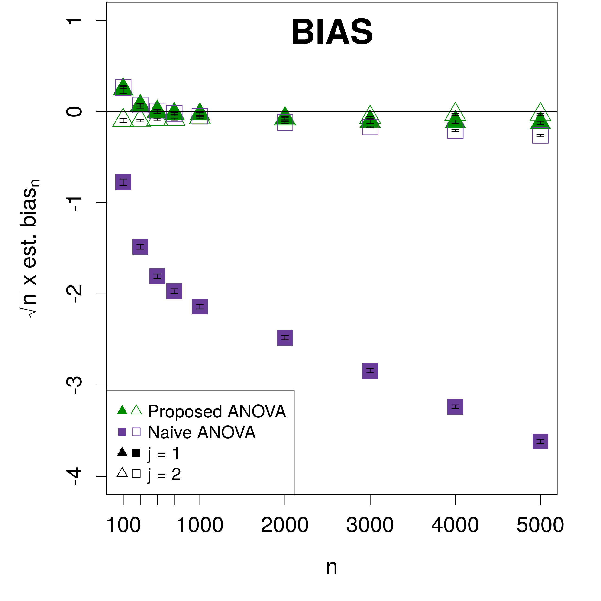
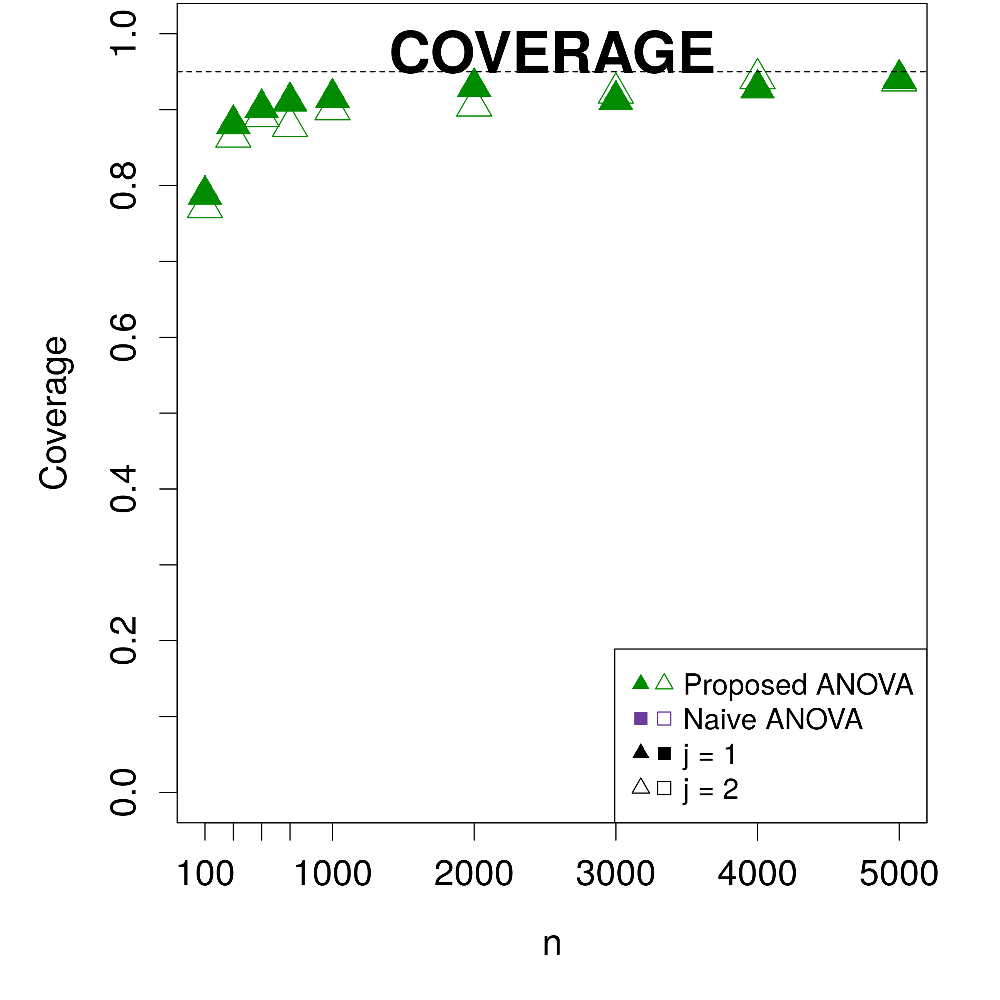
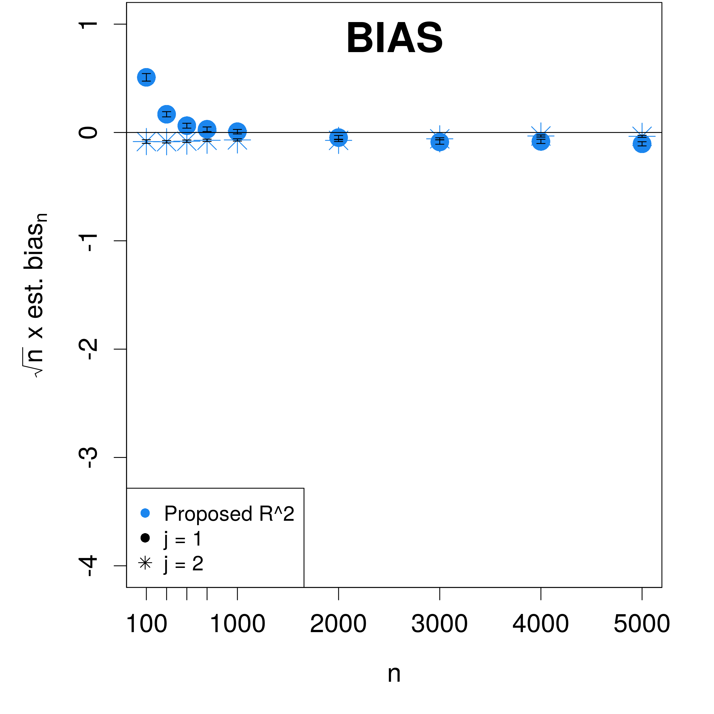
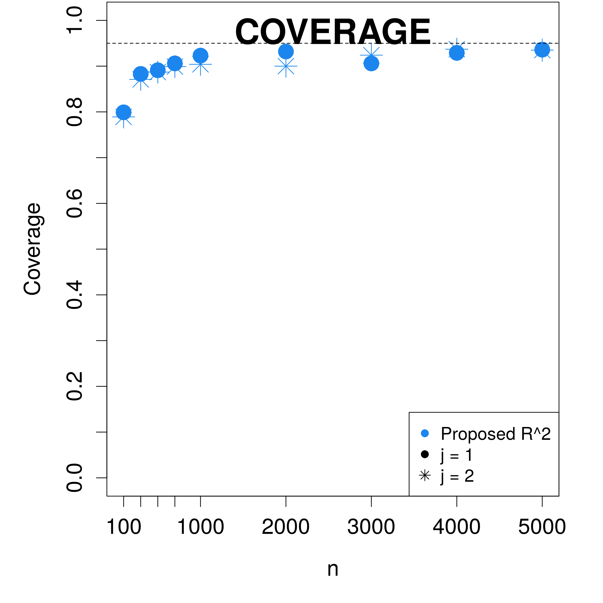
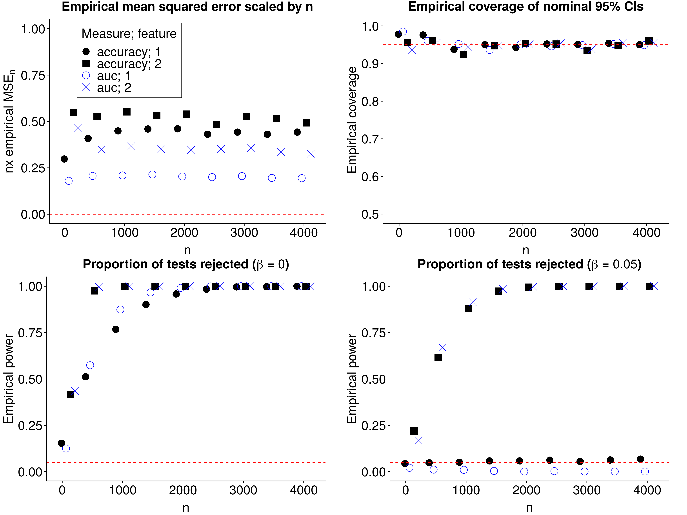
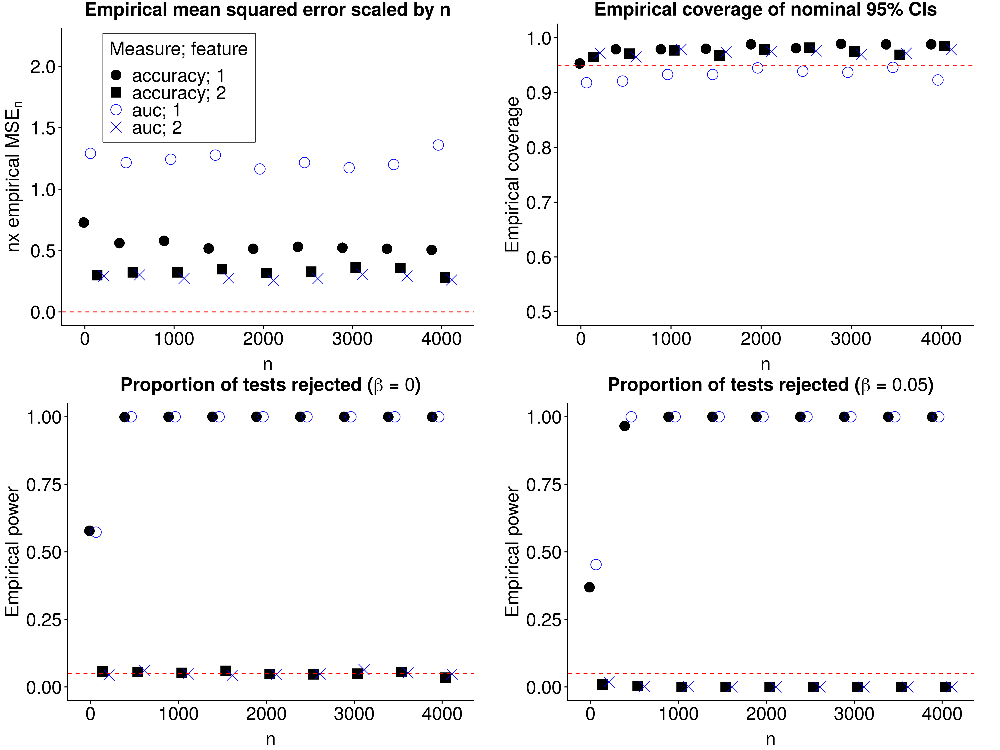
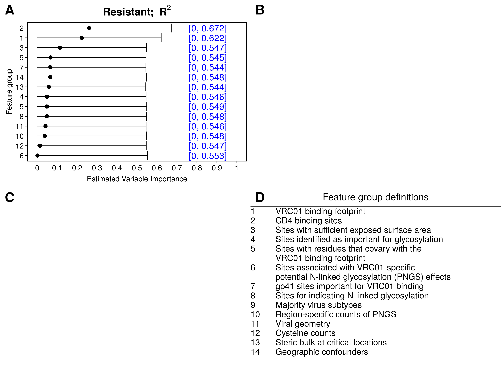
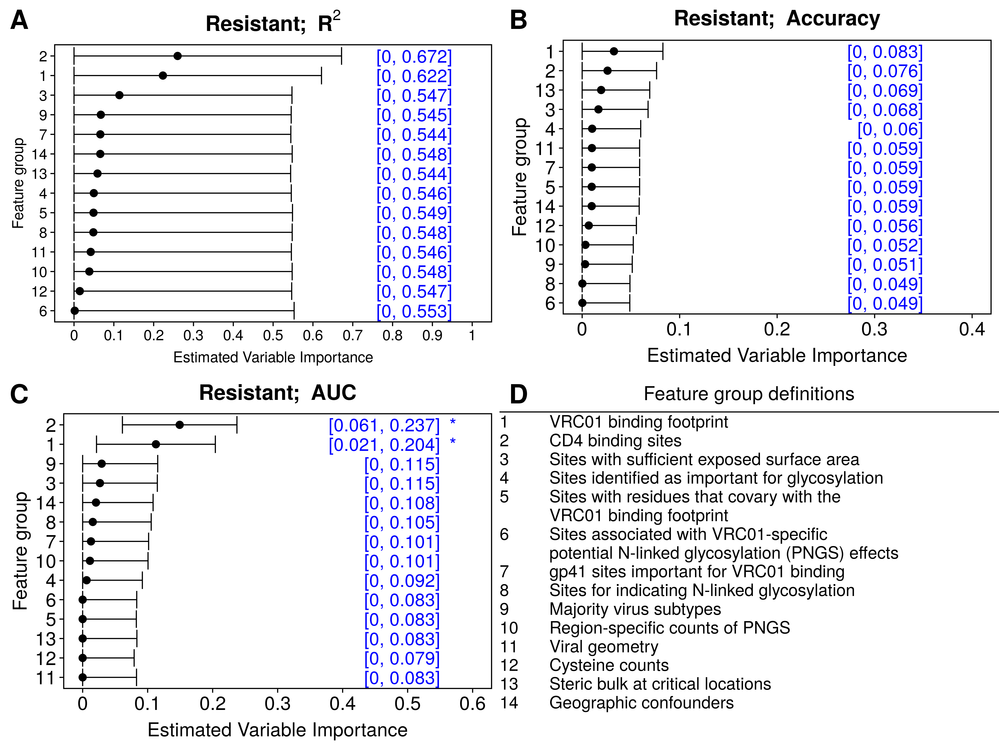

```{r xaringan-setup, include=FALSE, warning=FALSE}
library("xaringanthemer")

extra_css <- list(
  ".small" =  list(`font-size` = "80%"),
  ".large" =  list(`font-size` = "150%"),
  ".huge" =  list(`font-size` = "300%"),
  "ul li" = list(`margin-bottom` = "10px"),
  ".gray" = list(color = "#C0C0C0"),
  ".red" = list(color = "#FF0000"),
  ".blue1" = list(color = "#3AABBE"),
  ".blue2" = list(color = "#2A6D90"),
  ".blue3" = list(color = "#446874"),
  ".purple" = list(color = "#624474"),
  ".mutedred" = list(color = "#745344"),
  "a" = list(color = "#3AABBE"),
  "a:hover" = list("text-decoration" = "underline")
)
# set up fonts
style_mono_accent(
  base_color = "#446874",
  header_font_google = google_font("DM Sans"),
  text_font_google   = google_font("DM Sans", "400", "400i"),
  code_font_google   = google_font("Courier Prime"),
  extra_css = extra_css
)
```

<style type="text/css">
.remark-slide-content {
    font-size: 22px
}
</style>

## Motivation

```{r, echo = FALSE, out.height="450px", fig.align="center"}

```

---

## Motivation

In general: data $Z_1, \ldots, Z_n \stackrel{iid}{\sim} P_0$

--

* $Z_i := (X_i, Y_i);$

--

* $X_i \in \mathbb{R}^p$ is a vector of covariates

--

* $Y_i \in \mathbb{R}$ is the outcome of interest

--

* $s \subseteq \{1,\ldots,p\}$: index set

--

**Goal:** estimate the .green[importance] of $X_s$ in predicting $Y$

--

**Question:** how do we define importance?

---

## Linear regression variable importance

Objective: estimate the importance of $X_s$, $s \subseteq \{1, \ldots, p\}$

How do we typically do this in linear regression?

--

* Fit a linear regression of $Y$ on $X$ $\rightarrow \color{cyan}{\hat{\mu}(X)}$

--

* Fit a linear regression of $Y$ on $X_{-s}$ $\rightarrow \color{cyan}{\hat{\mu}_s(X)}$ 

--

* .green[Compare the fitted values] $[\hat{\mu}(X_i), \hat{\mu}_s(X_i)]$

--

Many ways to compare fitted values, including:
* ANOVA decomposition
* Difference in $R^2$ 

---

## Linear regression variable importance 

Difference in $R^2$: $$\left[1 - \frac{MSE(\hat{\mu})}{n^{-1}\sum_{i=1}^n\{Y_i - \overline{Y}_n\}^2}\right] - \left[1 - \frac{MSE(\hat{\mu}_s)}{n^{-1}\sum_{i=1}^n\{Y_i - \overline{Y}_n\}^2}\right]$$

Mean squared error (MSE) of a linear regression function $f$: $$MSE(f) = \ \frac{1}{n}\sum_{i=1}^n \{Y_i - f(X_i)\}^2$$

Inference:

* Test difference 

--

* Valid confidence interval

---

## Flexible estimator variable importance?

```{r xkcd-ml, echo = FALSE, out.width="370px", fig.align="center"}
knitr::include_graphics("img/machine_learning_2x.png")
```
.small[source: https://xkcd.com/1838/]

---

## Flexible estimator variable importance?

.pull-left[
What if I want to fit a more flexible estimator?

* better predictions?

* how do I define importance?

]

.pull-right[
```{r molnar-book, echo = FALSE, out.width="270px", fig.align="center"}
knitr::include_graphics("img/molnar_interpretable-ml.jpg")
```
]

---

## Types of variable importance

Two predominant notions of variable importance:

--

* algorithm-level: explain a black box (.green[extrinsic])

--

* population-level: explain a population (.green[intrinsic])

--

Our focus: .blue1[statistical inference] on .blue2[interpretable] intrinsic measures

---

## Intrinsic importance

What if we knew .blue2[$P_0$]?

--

Oracle prediction functions:
* $\mu_0(x) := E_{P_0}(Y \mid X = x)$
* $\mu_{0,s}(x) := E_{P_0}(Y \mid X_{-s} = x_{-s})$

--

Define population importance in terms of $\mu_0, \mu_{0,s}$!

---

## Intrinsic importance: ANOVA

Defining importance in terms of $\mu_0, \mu_{0,s}$: $$\text{ANOVA}_{0,s} := \frac{E_{P_0}\{\mu_0(X) - \mu_{0,s}(X)\}^2}{var_{P_0}(Y)}$$

Large $\text{ANOVA}_{0,s} \rightarrow$ $X_s$ important relative to $X_{-s}$

---

## Population ANOVA: estimation

Idea:

* $\mu_n \leftarrow$ estimate $\mu_0$

--

* $\mu_{n,s} \leftarrow$ estimate $\mu_{0,s}$

--

* $\sigma^2_n \leftarrow$ empirical variance of $Y$ 

--

* plug in: $$\text{ANOVA}_{n,s} = \frac{\frac{1}{n}\sum_{i=1}^n \{\mu_n(X_i) - \mu_{n,s}(X_i)\}^2}{\sigma^2_n}$$

--

This estimator .red[requires correction]! 

---

## Population ANOVA: corrected estimator

Debiasing: use the efficient influence function (EIF) $\phi_{0,s}$ 

$$\text{ANOVA}_{n,s} := \ \frac{\frac{1}{n}\sum_{i=1}^n \{\mu_n(X_i) - \mu_{n,s}(X_i)\}^2}{\sigma^2_n} + \frac{1}{n}\sum_{i=1}^n \phi_{0,s}(X_i)$$

--

Explicit form:

$$\text{ANOVA}_{n,s} = \left[1 - \frac{\frac{1}{n}\sum_{i=1}^n \{Y_i - \mu_n(X_i)\}^2}{\sigma^2_n}\right] - \left[1 - \frac{\frac{1}{n}\sum_{i=1}^n \{Y_i - \mu_{n,s}(X_i)\}^2}{\sigma^2_n}\right]$$

--

Corrected estimator: .blue1[difference in R-squared]!

---

## Population R-squared

$MSE(\mu, P_0) := E_{P_0}\{Y - \mu(X)\}^2$

$R^2(\mu, P_0) := 1 - \frac{MSE(\mu, P_0)}{var_{P_0}(Y)}$

$DR^2_{0,s} := R^2(\mu_0, P_0) - R^2(\mu_{0,s}, P_0)$

--

Equivalent to ANOVA decomposition .blue2[in the population]

--

Simple estimator does not require correction

---

## ANOVA (naive vs corrected)

```{r anova-naive-vs-corrected-perf, echo = FALSE, out.width="370px", fig.align="top"}


```

---

## R-squared

```{r r2-perf, echo = FALSE, out.width="370px", fig.align="top"}


```

---

## Summary (so far)

Results:

* ANOVA-based estimator requires correction 

--

* $R^2$-based estimator does not 

--

* valid confidence intervals for true importance

--

Questions:

* is $R^2$ phenomenon more general?

--

* hypothesis testing?

---

## General population variable importance

\(
\DeclareMathOperator*{\argmax}{arg\,max}
\)

Consider function classes $\mathcal{F}_s \subseteq \mathcal{F}$

Statistical framework for variable importance:

--

* $V(f, P)$: .blue1[predictiveness] of $f \in \mathcal{F}$ under distribution $P$ 

--

* $f_0 := \argmax_{f \in \mathcal{F}} V(f, P_0)$: _oracle prediction function_ in $\mathcal{F}$ 

--

* $f_{0,s} := \argmax_{f \in \mathcal{F}_s} V(f, P_0)$: oracle in $\mathcal{F}_s$

--

$V(f_0, P_0)$: _oracle predictiveness_

--

$V(f_{0,s}, P_0)$: _residual oracle predictiveness_

--

.green[Variable importance]: $\psi_{0,s} := V(f_0, P_0) - V(f_{0,s}, P_0)$

---

## Example measures

$R^2$: $V(f, P) = 1 - E_P\{Y - f(X)\}^2 / var_P(Y)$

--

Classification accuracy: $V(f, P) = P\{Y = f(X)\}$

--

AUC: $V(f, P) = P\{f(X_1) < f(X_2) \mid Y_1 = 0, Y_2 = 1\}$

--

Pseudo-$R^2$: $V(f, P) = 1 - \frac{E_P[Y\log f(X) - (1-Y)\log\{1-f(X)\}]}{P(Y=1)\log P(Y=1) + \{1-P(Y=1)\}\log\{1-P(Y=1)\}}$

---

## Plug-in estimators of variable importance

Simple estimator:

--

* obtain estimator $f_n$ of $f_0$ (e.g., using machine learning)

--

* obtain estimator $f_{n,s}$ of $f_{0,s}$ 

--

* plug in: $\psi_{n,s} := V(f_n, P_n) - V(f_{n,s}, P_n)$

---

## Plug-in estimators of variable importance

$\psi_{0,s} = V(f_0, P_0) - V(f_{0,s}, P_0)$

$\psi_{n,s} = V(f_n, P_n) - V(f_{n,s}, P_n)$

Questions:

* when is $\psi_{n,s}$ .blue1[regular] and .blue2[asymptotically linear]?

--

** implies nice asymptotic distribution
** analytic formula for variance

--

* can we test $H_0: \psi_{0,s} = 0$?

---

## Large-sample behavior of $\psi_{n,s}$

Under regularity conditions, $$\sqrt{n}(\psi_{n,s} - \psi_{0,s}) \to_d N(0, \tau^2_{0,s})$$

--

* $\tau^2_{0,s}$ based on EIF $\varphi_{0,s}(z)$
** $\varphi_{0,s}(z)$ depends on chosen measure
* $\psi_{n,s}$ .blue1[efficient]

---

## Estimation

Plug-in estimator: guaranteed to be $> 0$

--

.red[Poor empirical performance] for truly small importance when machine learning is used

--

We propose a .green[cross-fit estimator] instead

---

## Hypothesis testing

Under $H_0: \psi_{0,s} = 0$, $\varphi_{0,s}(z) = 0$ 

--

Similar phenomenon occurs in linear regression:
* use $\chi^2$ instead of Normal distribution

--

Procedure: test difference after sample splitting

---

## Overall procedure


---

## Experiment: binary outcome, bivariate feature vector

$Y \sim Bern(0.6)$; $X_1 \mid Y \sim N(\mu_1, \Sigma)$

Under $H_0$, $X_2 \mid Y \sim N(0, \Sigma)$

Under $H_1$, $X_2 \mid Y \sim N(\mu_2, \Sigma)$

Investigate:
* scaled empirical mean squared error
* empirical coverage of nominal 95% CIs
* empirical type I error (or power)

Estimate using cross-fitting and regression stacking

---

## Experiment: results under $H_1$

```{r generalvim-h1, echo = FALSE, out.width = "400px", fig.align = "center"}

```

---

## Experiment: results under $H_0$

```{r generalvim-h0, echo = FALSE, out.width = "400px", fig.align = "center"}

```

---

## Studying an antibody against HIV-1 infection

```{r vrc01, echo = FALSE, out.width = "300px", fig.align = "center"}
knitr::include_graphics("img/amp.png")
```

* 611 HIV-1 pseudoviruses
* Outcome: neutralization sensitivity to antibody
* 800 individual features, 13 groups of interest
* Estimate using cross-fitting and regression stacking

---

## Studying an antibody against HIV-1 infection

```{r vrc01-r2, echo = FALSE, out.height="460px", fig.align="top"}

```

---

## Studying an antibody against HIV-1 infection

```{r vrc01-r2-acc-auc, echo = FALSE, out.height="460px", fig.align="top"}

```

---

## Conclusions

.pull-left[
Check out the papers: 

* [R-squared-based importance](https://doi.org/10.1111/biom.13392) (Williamson et al., [_Biometrics_, 2020])
* [General variable importance measures](https://arxiv.org/abs/2004.03683) (Williamson et al., [_arXiv_, 2020])
* [Shapley-based importance](https://arxiv.org/abs/2006.09481) (Williamson and Feng, [_ICML_, 2020])
]

.pull-right[
Check out the software:

* [R package `vimp`](https://github.com/bdwilliamson/vimp)
* [Python package `vimpy`](https://github.com/bdwilliamson/vimpy)
]

`r icon::fa('github')` https://github.com/bdwilliamson
`r icon::fa('globe')` https://bdwilliamson.github.io
