```{r xaringan-setup, include=FALSE, warning=FALSE}
library("xaringanthemer")

extra_css <- list(
  ".small" =  list(`font-size` = "80%"),
  ".large" =  list(`font-size` = "150%"),
  ".huge" =  list(`font-size` = "300%"),
  "ul li" = list(`margin-bottom` = "10px"),
  ".gray" = list(color = "#C0C0C0"),
  ".red" = list(color = "#FF0000"),
  ".blue1" = list(color = "#3AABBE"),
  ".blue2" = list(color = "#2A6D90"),
  ".blue3" = list(color = "#446874"),
  ".purple" = list(color = "#624474"),
  ".mutedred" = list(color = "#745344"),
  "a" = list(color = "#3AABBE"),
  "a:hover" = list("text-decoration" = "underline")
)
# set up fonts
style_mono_accent(
  base_color = "#446874",
  header_font_google = google_font("DM Sans"),
  text_font_google   = google_font("DM Sans", "400", "400i"),
  code_font_google   = google_font("Courier Prime"),
  extra_css = extra_css
)

xaringanExtra::use_tile_view()
```

<style type="text/css">
.remark-slide-content {
    font-size: 22px
}
</style>

## Motivation

```{r, echo = FALSE, out.height="450px", fig.align="center"}

```

---

## Motivation

In general: data $Z_1, \ldots, Z_n \stackrel{iid}{\sim} P_0$

--

* $Z_i := (X_i, Y_i);$

--

* $X_i \in \mathbb{R}^p$ is a vector of covariates;

--

* $Y_i \in \mathbb{R}$ is the outcome of interest;

--

* $s \subseteq \{1,\ldots,p\}$: index set

--

**Goal:** estimate the .green[importance] of $X_s$ in predicting $Y$

--

**Question:** how do we define importance?

---

## Linear regression variable importance

Objective: estimate the importance of $X_s$, $s \subseteq \{1, \ldots, p\}$

How do we typically do this in linear regression?

--

* Fit a linear regression of $Y$ on $X$ $\rightarrow \color{cyan}{\hat{\mu}(X)}$

--

* Fit a linear regression of $Y$ on $X_{-s}$ $\rightarrow \color{cyan}{\hat{\mu}_s(X)}$

--

* .green[Compare the fitted values] $[\hat{\mu}(X_i), \hat{\mu}_s(X_i)]$

--

Many ways to compare fitted values, including:
* ANOVA decomposition
* Difference in $R^2$

---

## Linear regression variable importance

Difference in $R^2$: $$\left[1 - \frac{MSE(\hat{\mu})}{n^{-1}\sum_{i=1}^n\{Y_i - \overline{Y}_n\}^2}\right] - \left[1 - \frac{MSE(\hat{\mu}_s)}{n^{-1}\sum_{i=1}^n\{Y_i - \overline{Y}_n\}^2}\right]$$

Mean squared error (MSE) of a linear regression function $f$: $$MSE(f) = \ \frac{1}{n}\sum_{i=1}^n \{Y_i - f(X_i)\}^2$$

Inference:

* Test difference

--

* Valid confidence interval

---

## Flexible estimator variable importance?

```{r xkcd-ml, echo = FALSE, out.width="370px", fig.align="center"}
knitr::include_graphics("img/machine_learning_2x.png")
```
.small[source: https://xkcd.com/1838/]

---

## Flexible estimator variable importance?

.pull-left[
What if I want to fit a more flexible estimator?

* better predictions?

* how do I define importance?

]

.pull-right[
```{r molnar-book, echo = FALSE, out.width="270px", fig.align="center"}
knitr::include_graphics("img/molnar_interpretable-ml.jpg")
```
]

---

## Types of variable importance

Two predominant notions of variable importance:

--

* algorithm-level: explain a black box (.green[extrinsic])

--

* population-level: explain a population (.green[intrinsic])

--

Our focus: .blue1[statistical inference] on .blue2[interpretable] intrinsic measures

---

## Intrinsic importance

What if we knew $\color{blue}{P_0}$ ?

--

Oracle prediction functions:
* $\mu_0(x) := E_{P_0}(Y \mid X = x)$
* $\mu_{0,s}(x) := E_{P_0}(Y \mid X_{-s} = x_{-s})$

--

Define population importance in terms of $\mu_0, \mu_{0,s}$!

---

## Intrinsic importance: ANOVA

Defining importance in terms of $\mu_0, \mu_{0,s}$: $$\text{ANOVA}_{0,s} := \frac{E_{P_0}\{\mu_0(X) - \mu_{0,s}(X)\}^2}{var_{P_0}(Y)}$$

Large $\text{ANOVA}_{0,s} \rightarrow$ $X_s$ important relative to $X_{-s}$

---

## Population ANOVA: estimation

Idea:

* $\mu_n \leftarrow$ estimate $\mu_0$

--

* $\mu_{n,s} \leftarrow$ estimate $\mu_{0,s}$

--

* $\sigma^2_n \leftarrow$ empirical variance of $Y$

--

* plug in: $$\text{ANOVA}_{n,s} = \frac{\frac{1}{n}\sum_{i=1}^n \{\mu_n(X_i) - \mu_{n,s}(X_i)\}^2}{\sigma^2_n}$$

--

This estimator .red[requires correction]!

---

## Population ANOVA: corrected estimator

Debiasing: use the efficient influence function (EIF) $\phi_{0,s}$

$$\text{ANOVA}_{n,s} := \ \frac{\frac{1}{n}\sum_{i=1}^n \{\mu_n(X_i) - \mu_{n,s}(X_i)\}^2}{\sigma^2_n} + \frac{1}{n}\sum_{i=1}^n \phi_{0,s}(X_i)$$

--

Explicit form:

$$\left[1 - \frac{\frac{1}{n}\sum_{i=1}^n \{Y_i - \mu_n(X_i)\}^2}{\sigma^2_n}\right] - \left[1 - \frac{\frac{1}{n}\sum_{i=1}^n \{Y_i - \mu_{n,s}(X_i)\}^2}{\sigma^2_n}\right]$$

--

Corrected estimator: .blue1[difference in R-squared]!

---

## Population R-squared

$MSE(\mu, P_0) := E_{P_0}\{Y - \mu(X)\}^2$

--

$R^2(\mu, P_0) := 1 - \frac{MSE(\mu, P_0)}{var_{P_0}(Y)}$

--

$DR^2_{0,s} := R^2(\mu_0, P_0) - R^2(\mu_{0,s}, P_0)$

--

Equivalent to ANOVA decomposition .blue2[in the population]

--

Simple estimator does not require correction

---

## ANOVA (naive vs corrected)

```{r anova-naive-vs-corrected-perf, echo = FALSE, out.width="370px", fig.align="top"}


```

---

## R-squared

```{r r2-perf, echo = FALSE, out.width="370px", fig.align="top"}


```

---

## Summary (so far)

Results:

* ANOVA-based estimator requires correction

--

* $R^2$-based estimator does not

--

* valid confidence intervals for true importance

--

Questions:

* is $R^2$ phenomenon more general?

--

* hypothesis testing?

---

## General population variable importance

Consider function classes $\mathcal{F}_{-s} \subseteq \mathcal{F}$

Statistical framework for variable importance:

--

* $V(f, P)$: .blue1[predictiveness] of $f \in \mathcal{F}$ under distribution $P$

--

* $f_0 := \underset{f \in \mathcal{F}}{\text{arg}\,\text{max}}\, V(f, P_0)$: _oracle prediction function_ in $\mathcal{F}$

--

* $f_{0,-s} := \underset{f \in \mathcal{F}_{-s}}{\text{arg}\,\text{max}}\, V(f, P_0)$: oracle in $\mathcal{F}_{-s}$

--

$V(f_0, P_0)$: _oracle predictiveness_

--

$V(f_{0,-s}, P_0)$: _residual oracle predictiveness_

--

.blue2[Variable importance]: $\psi_{0,s} := V(f_0, P_0) - V(f_{0,-s}, P_0)$

---

## Example measures

$R^2$ : $V(f, P) = 1 - E_P\{Y - f(X)\}^2 / var_P(Y)$

--

Classification accuracy: $V(f, P) = P\{Y = f(X)\}$

AUC: $V(f, P) = P\{f(X_1) < f(X_2) \mid Y_1 = 0, Y_2 = 1\}$

--

Pseudo- $R^2$ : $1 - \frac{E_P[Y \log f(X) - (1 - Y)\log \{1 - f(X)\}]}{P(Y = 1)\log P(Y = 1) + P(Y = 0)\log P(Y = 0)}$

---

## Plug-in estimators of variable importance

Simple estimator:

--

* obtain estimator $f_n$ of $f_0$ (e.g., using machine learning)

--

* obtain estimator $f_{n,s}$ of $f_{0,s}$

--

* plug in: $\psi_{n,s} := V(f_n, P_n) - V(f_{n,s}, P_n)$

---

## Plug-in estimators of variable importance

$\psi_{0,s} = V(f_0, P_0) - V(f_{0,s}, P_0)$

$\psi_{n,s} = V(f_n, P_n) - V(f_{n,s}, P_n)$

Questions:

* when is $\psi_{n,s}$ .blue1[regular] and .blue2[asymptotically linear]?

--

  * implies nice asymptotic distribution
  * analytic formula for variance

--

* can we test $H_0: \psi_{0,s} = 0$?

---

## Large-sample behavior

Under regularity conditions, $$\sqrt{n}(\psi_{n,s} - \psi_{0,s}) \to_d N(0, \tau^2_{0,s})$$

--

* $\tau^2_{0,s}$ based on EIF $\varphi_{0,s}(z)$
  * $\varphi_{0,s}(z)$ depends on chosen measure
* $\psi_{n,s}$ .blue1[efficient]

---

## Estimation

Plug-in estimator: guaranteed to be $> 0$

--

.red[Poor empirical performance] for truly small importance when machine learning is used

--

We propose a .green[cross-fit estimator] instead

---

## Hypothesis testing

Under $H_0: \psi_{0,s} = 0$, $\varphi_{0,s}(z) = 0$

--

Similar phenomenon occurs in linear regression: use $\chi^2$

Procedure: test difference after sample splitting

---

## Overall procedure

```{r samplesplit, echo = FALSE, out.width = "720px", fig.align = "center"}
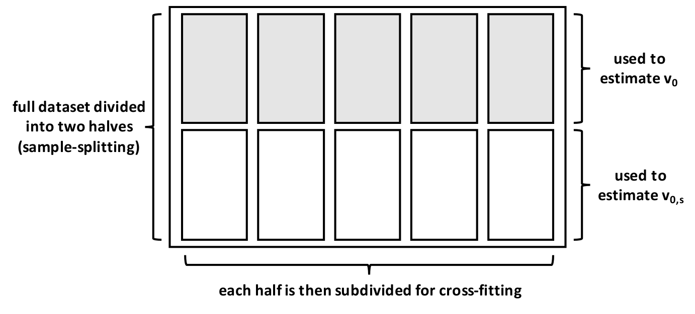
```

---

## Experiment: binary outcome, bivariate feature vector

$Y \sim Bern(0.6)$; $X_1 \mid Y \sim N(\mu_1, \Sigma)$

Under $H_0$, $X_2 \mid Y \sim N(0, \Sigma)$

Under $H_1$, $X_2 \mid Y \sim N(\mu_2, \Sigma)$

Investigate:
* scaled empirical mean squared error
* empirical coverage of nominal 95% CIs
* empirical type I error (or power)

Estimate using cross-fitting and regression stacking

---

## Experiment: results under $H_1$

```{r generalvim-h1, echo = FALSE, out.width = "640px", fig.align = "center"}

```

---

## Experiment: results under $H_0$

```{r generalvim-h0, echo = FALSE, out.width = "640px", fig.align = "center"}

```

---

## Studying an antibody against HIV-1 infection

```{r vrc01, echo = FALSE, out.width = "300px", fig.align = "center"}
knitr::include_graphics("img/amp.png")
```

* 611 HIV-1 pseudoviruses
* Outcome: neutralization sensitivity to antibody
* 800 individual features, 13 groups of interest
* Estimate using cross-fitting and regression stacking

---

## Predicting neutralization sensitivity

```{r vrc01-r2, echo = FALSE, out.height="480px", fig.align="top"}
knitr::include_graphics("img/vim_ic50.censored_pres_r2_conditional_simple.png")
```

---

## Predicting neutralization sensitivity

```{r vrc01-r2-acc-auc, echo = FALSE, out.height="480px", fig.align="top"}

```

---

## Summary (so far)

Simple estimators of importance are
* .blue1[unbiased] and
* .blue2[efficient]

--

even if machine learning techniques are used.

--

Valid hypothesis testing via sample splitting

---

## Collinearity causes problems

$V(f_0, P_0) - V(f_{0,s}, P_0)$: importance of $X_s$ relative to $X$

--

$\color{red}{\text{Potential issue}}$: correlated features

Example: two perfectly correlated features, $X_1$ and $X_2$

--

$V(f_0, P_0) - V(f_{0,1}, P_0) = 0$

--

$V(f_0, P_0) - V(f_{0,2}, P_0) = 0$

--

Is there another useful definition of importance?

---

## Shapley population variable importance (SPVIM)

```{r spvim-example, echo = FALSE, out.width = "720px", fig.align = "center"}
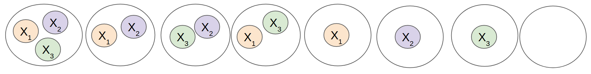
```

Idea: average contribution over subsets

---

## SPVIM

The SPVIM for variable $X_j$ is

```{r spvim-def-1, echo = FALSE, out.width = "720px", fig.align = "center"}
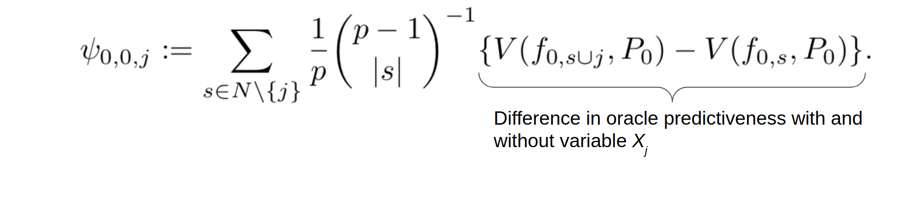
```

---

## SPVIM

The SPVIM for variable $X_j$ is

```{r spvim-def-2, echo = FALSE, out.width = "720px", fig.align = "center"}
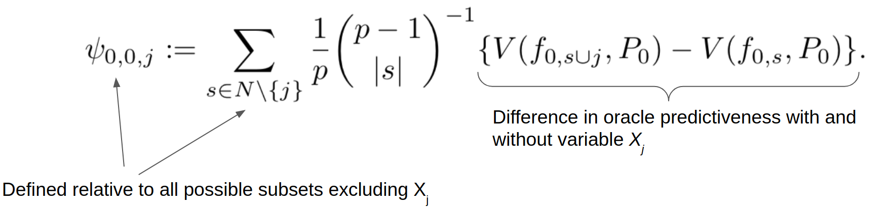
```

---

## SPVIM

The SPVIM for variable $X_j$ is

```{r spvim-def-3, echo = FALSE, out.width = "720px", fig.align = "center"}
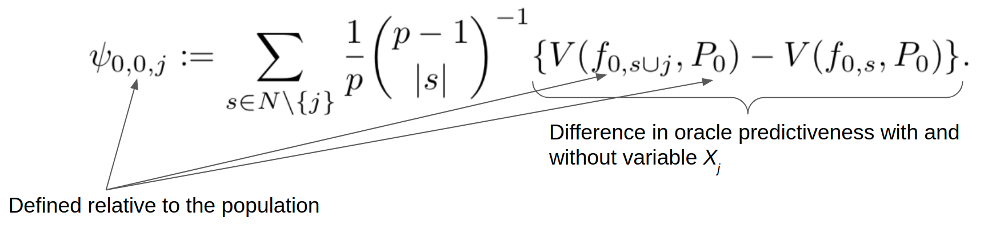
```

---

## SPVIM

Equivalent definition (Charnes, 1988):

```{r spvim-def-4, echo = FALSE, out.width = "720px", fig.align = "center"}
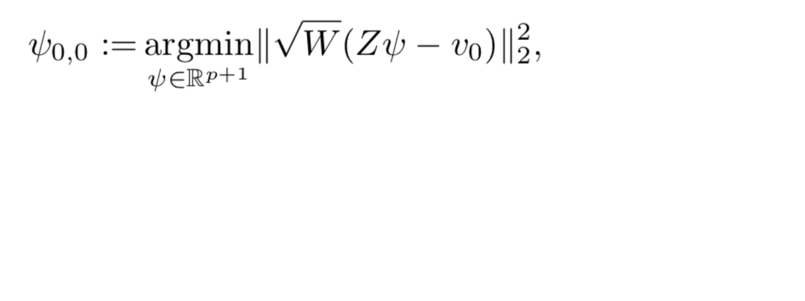
```

---

## SPVIM

Equivalent definition (Charnes, 1988):

```{r spvim-def-5, echo = FALSE, out.width = "720px", fig.align = "center"}
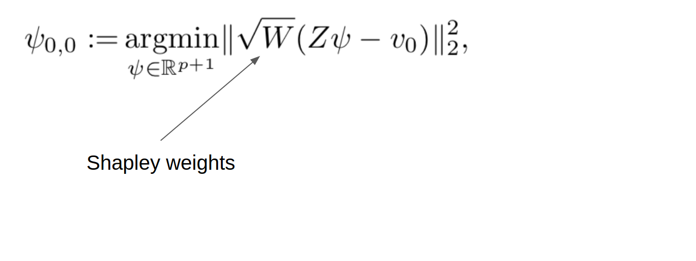
```

---

## SPVIM

Equivalent definition (Charnes, 1988):

```{r spvim-def-6, echo = FALSE, out.width = "720px", fig.align = "center"}
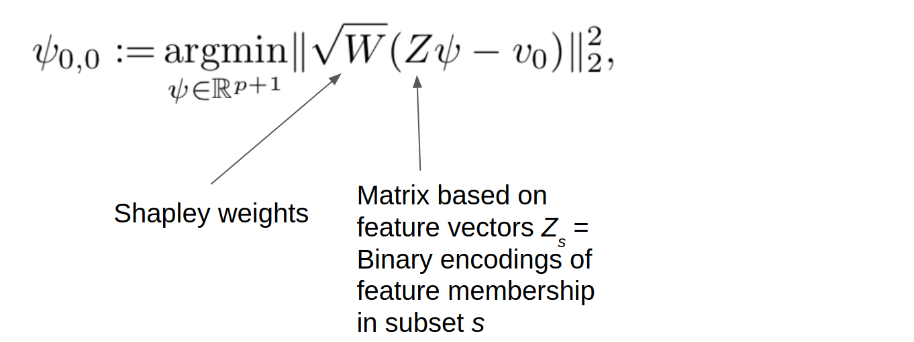
```

---

## SPVIM

Equivalent definition (Charnes, 1988):

```{r spvim-def-7, echo = FALSE, out.width = "720px", fig.align = "center"}
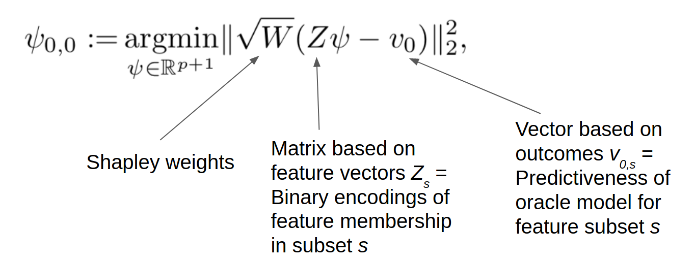
```

---

## Sampling-based estimator

1. Sample $m$ feature subsets from distribution defined by Shapley weights.
--

2. Estimator is solution to weighted least squares problem:

```{r spvim-est-1, echo = FALSE, out.width = "720px", fig.align = "center"}
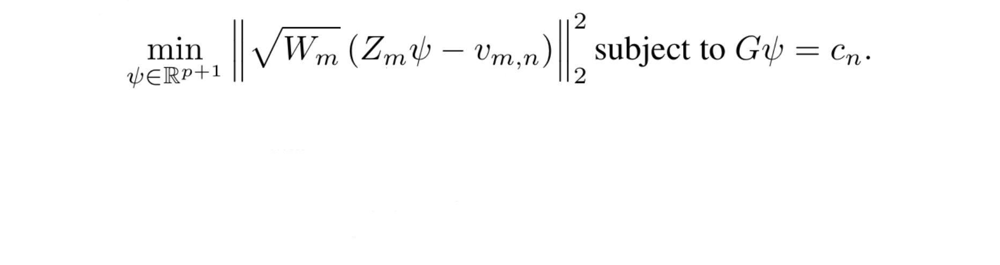
```

---

## Sampling-based estimator

1. Sample $m$ feature subsets from distribution defined by Shapley weights.
2. Estimator is solution to weighted least squares problem:

```{r spvim-est-2, echo = FALSE, out.width = "720px", fig.align = "center"}
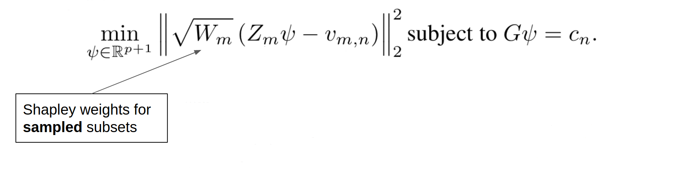
```

---

## Sampling-based estimator

1. Sample $m$ feature subsets from distribution defined by Shapley weights.
2. Estimator is solution to weighted least squares problem:

```{r spvim-est-3, echo = FALSE, out.width = "720px", fig.align = "center"}
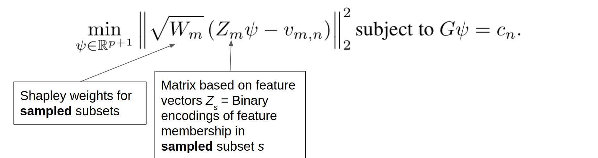
```

---

## Sampling-based estimator

1. Sample $m$ feature subsets from distribution defined by Shapley weights.
2. Estimator is solution to weighted least squares problem:

```{r spvim-est-4, echo = FALSE, out.width = "720px", fig.align = "center"}
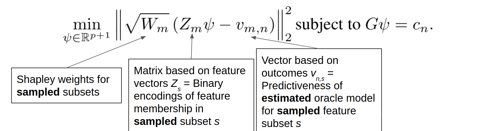
```

---

## Sampling-based estimator

1. Sample $m$ feature subsets from distribution defined by Shapley weights.
2. Estimator is solution to weighted least squares problem:

```{r spvim-est-5, echo = FALSE, out.width = "720px", fig.align = "center"}
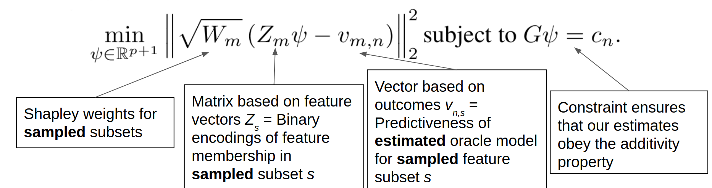
```

---

## Large-sample behavior

Suppose we sample $m = \gamma n$ subsets

Under regularity conditions, $$\sqrt{n}(\psi_{m,n} - \psi_{0,0}) \to_d N(0, \Sigma_0), \text{where}$$

```{r asymptotics-1, echo = FALSE, out.width = "720px", fig.align = "center"}
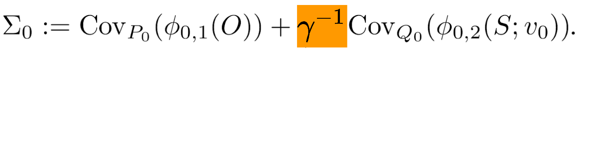
```

---

## Large-sample behavior

Suppose we sample $m = \gamma n$ subsets

Under regularity conditions, $$\sqrt{n}(\psi_{m,n} - \psi_{0,0}) \to_d N(0, \Sigma_0), \text{where}$$

```{r asymptotics-2, echo = FALSE, out.width = "720px", fig.align = "center"}
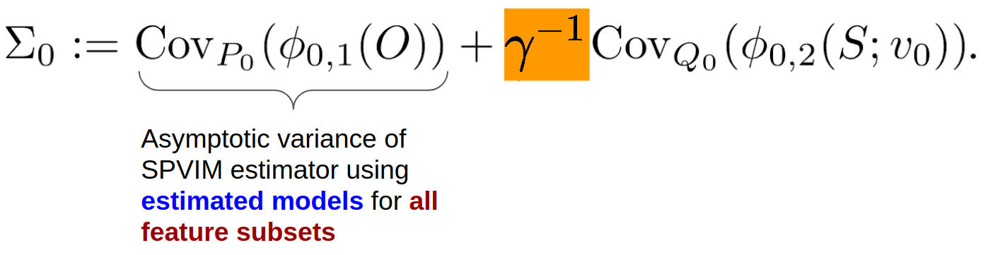
```

---

## Large-sample behavior

Suppose we sample $m = \gamma n$ subsets

Under regularity conditions, $$\sqrt{n}(\psi_{m,n} - \psi_{0,0}) \to_d N(0, \Sigma_0), \text{where}$$

```{r asymptotics-3, echo = FALSE, out.width = "720px", fig.align = "center"}
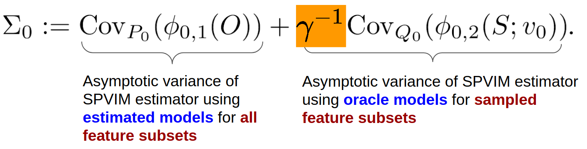
```

---

## Large-sample behavior

Suppose we sample $m = \gamma n$ subsets

Under regularity conditions, $$\sqrt{n}(\psi_{m,n} - \psi_{0,0}) \to_d N(0, \Sigma_0), \text{where}$$

```{r asymptotics-4, echo = FALSE, out.width = "720px", fig.align = "center"}
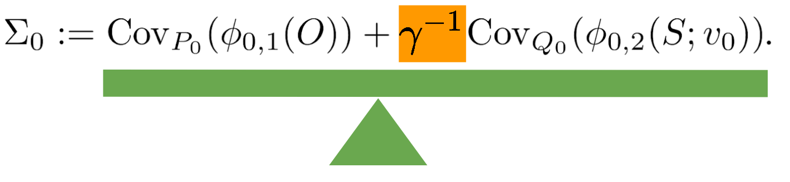
```

---

## Investigating performance

$X_1, \ldots, X_{200} \sim N_{200}(0, \Sigma)$, where $\Sigma$ is the identity matrix except:
* $\Sigma_{1,11} = \Sigma_{11,1} = 0.7$
* $\Sigma_{3,12} = \Sigma_{3,13} = \Sigma_{12,3} = \Sigma_{13,3} = 0.3$
* $\Sigma_{5,14} = \Sigma_{14,5} = 0.05$

$Y \mid X = x \sim N(\sum_{j \in \{1, 3, 5\}}f_j(x_j), 1)$

--

.blue1[Directly important features]: 1, 3, 5

.blue2[Indirectly important features]: 11--14

---

## Results (directly important)

```{r spvim-sim-direct, echo = FALSE, out.width = "780px", fig.align = "center"}
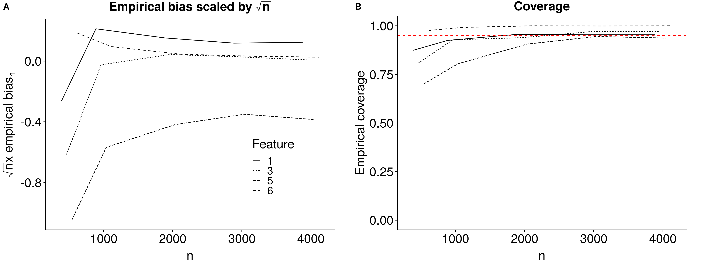
```

---

## Results (indirectly important)

```{r spvim-sim-indirect, echo = FALSE, out.width = "780px", fig.align = "center"}
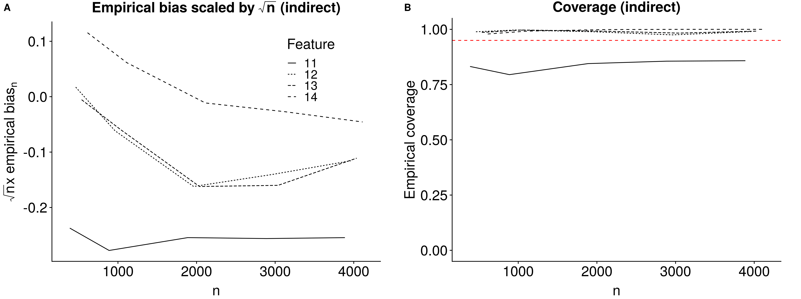
```

---

## Conclusion

.blue1[Population-based] variable importance:
* wide variety of meaningful measures
* simple estimators
* machine learning okay
* valid inference, testing

Two interpretations:
* conditional
* subset-averaged (SPVIM)

---

## Acknowledgments

Collaborators: Marco Carone, Noah Simon, Jean Feng, Peter Gilbert

Funding: NIH F31 AI140836

.pull-left[
Check out the papers:

* [R-squared-based importance](https://doi.org/10.1111/biom.13392) (Williamson et al., [_Biometrics_, 2020])
* [General variable importance measures](https://arxiv.org/abs/2004.03683) (Williamson et al., [_arXiv_, 2020])
* [Shapley-based importance](https://arxiv.org/abs/2006.09481) (Williamson and Feng, [_ICML_, 2020])
]

.pull-right[
Check out the software:

* [R package `vimp`](https://github.com/bdwilliamson/vimp)
* [Python package `vimpy`](https://github.com/bdwilliamson/vimpy)
]

`r icon::fa('github')` https://github.com/bdwilliamson
`r icon::fa('globe')` https://bdwilliamson.github.io
